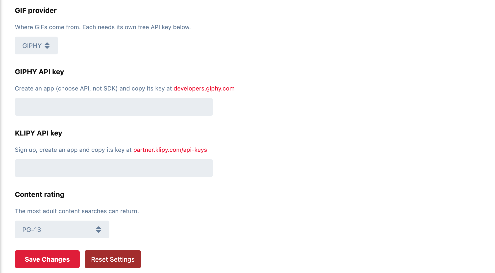

# Reel

GIF search in the composer for Flarum 2. Press **GIF**, pick from what's trending or search, and the GIF drops straight into the post.



## How it works

- **A GIF button in the composer's toolbar.** It opens a picker with **trending** GIFs; type to **search**. More load as you scroll.
- **One click to add.** The GIF goes into the post where your cursor was, and the picker closes.
- **Works with Flarum's editor and [Scribe](https://github.com/ernestdefoe/scribe).** It writes a Markdown image, which Scribe turns into a real image. On a forum with neither Markdown nor Scribe, it writes BBCode `[img]` instead.
- **Phones too.** Two columns on a small screen, three on a large one, and nothing jumps around as more results load.

## Providers

Choose one in the settings and paste its key. Both have free tiers.

| Provider | Get a key |
|---|---|
| **GIPHY** | [developers.giphy.com](https://developers.giphy.com/dashboard/?create=true): create an app, choosing **API** (not SDK) |
| **KLIPY** | [partner.klipy.com/api-keys](https://partner.klipy.com/api-keys) |

**Why not Tenor?** Google stopped issuing Tenor API keys in January 2026 and shut its API down on 30 June 2026. Discord, X and others moved to GIPHY and KLIPY, which is why Reel supports those two.

## Settings

- **GIF provider** and its **API key**.
- **Content rating:** G, PG, PG-13 (the default) or R. It's the most adult content a search can return.
- **Permission:** *Search for GIFs*, given to members on install. Without a key, or without the permission, the button doesn't appear at all.

## Good to know

- **Your API key stays private.** Searches go through your forum, never straight from visitors' browsers, so the key is never in a page anyone can read.
- **Results are cached for ten minutes,** so a busy forum searching "lol" all afternoon costs the provider one request, not hundreds. KLIPY's free test keys allow 100 requests an hour; caching is what keeps a forum inside that.
- **Searches are rate-limited** to 30 a minute per member: plenty for typing, too few for a script to drain your quota.
- **The GIFs themselves load from the provider's own servers**, as on every site that uses them, and the picker credits the provider as their terms require.

## Installation

```sh
composer require ernestdefoe/reel
php flarum migrate
php flarum cache:clear
```

Then enable **Reel**, choose a provider and paste its key.

## Updating

```sh
composer update ernestdefoe/reel
php flarum cache:clear
```

## Licence

MIT. See [LICENSE](LICENSE).
